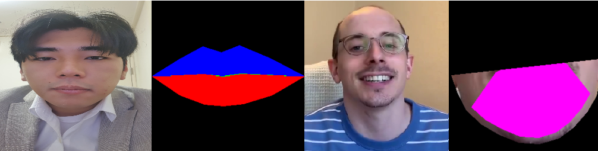
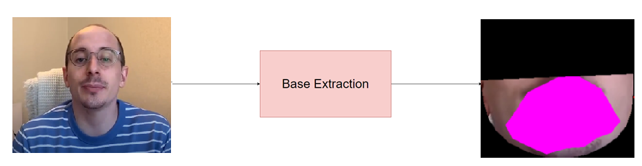
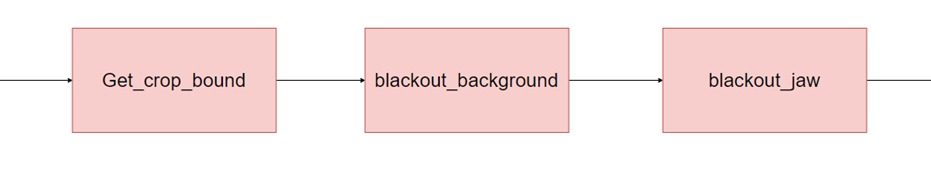
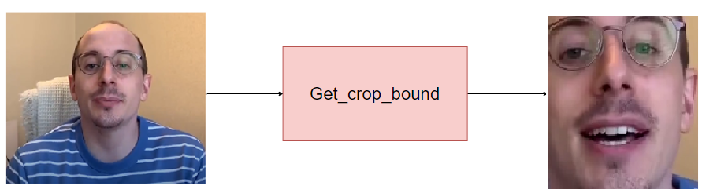
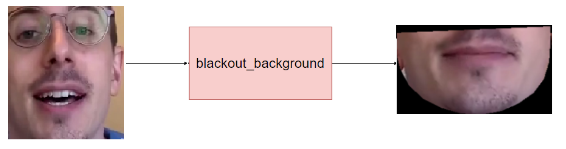
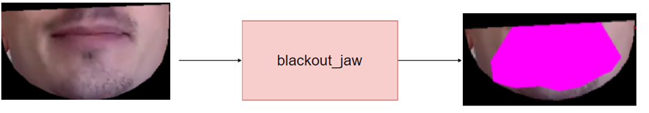

# Lip_Base_Extraction
Part of my repository, lip2lip_Research. We considered the facial muscles that change as the mouth shape changes in more detail.

!

Hello, I'm Kang Minjun from Korea Kwangwoon University Y2X team.
Projects related to this can be found at [this](https://github.com/Minjun-KANG/lip2lip_Research).

The bottom is the System Diagram.

* Ideal output, Includes more facial muscles and clowns than ever before.

* lip2lip output

* Segmentation diagram (in base extraction block)

* Get crop boundary block (crop face by 68.dat)

* Blackout background (crop jaw)

* Blackout_jaw (Fill Mouth)

